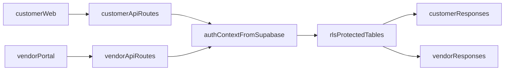

# Core Flows DB Wiring Plan

## Goal

Wire `customer-web` and `vendor-portal` core flows to the database, replacing static and in-memory stores while enforcing real authenticated ownership via Supabase Auth + RLS.

## Current State Snapshot

- `customer-web` core flows are backed by static modules and in-memory order store:
  - `[apps/customer-web/src/data/neighborhoods.ts](/Users/mikaelguillin/projects/neighborhood-tasting-menu-2/apps/customer-web/src/data/neighborhoods.ts)`
  - `[apps/customer-web/src/lib/order-store.ts](/Users/mikaelguillin/projects/neighborhood-tasting-menu-2/apps/customer-web/src/lib/order-store.ts)`
  - `[apps/customer-web/src/app/api/orders/route.ts](/Users/mikaelguillin/projects/neighborhood-tasting-menu-2/apps/customer-web/src/app/api/orders/route.ts)`
- `vendor-portal` ops flows are backed by in-memory vendor ops store:
  - `[apps/vendor-portal/src/lib/vendor-ops-store.ts](/Users/mikaelguillin/projects/neighborhood-tasting-menu-2/apps/vendor-portal/src/lib/vendor-ops-store.ts)`
  - `[apps/vendor-portal/src/app/api/vendor/ops/queue/route.ts](/Users/mikaelguillin/projects/neighborhood-tasting-menu-2/apps/vendor-portal/src/app/api/vendor/ops/queue/route.ts)`
  - `[apps/vendor-portal/src/app/api/vendor/ops/inventory/route.ts](/Users/mikaelguillin/projects/neighborhood-tasting-menu-2/apps/vendor-portal/src/app/api/vendor/ops/inventory/route.ts)`
- Implemented DB migrations currently only include `health_checks`:
  - `[supabase/migrations/202604220001_initial_schema.sql](/Users/mikaelguillin/projects/neighborhood-tasting-menu-2/supabase/migrations/202604220001_initial_schema.sql)`
- Target schema is documented but not yet migrated:
  - `[DATABASE_SCHEMA.md](/Users/mikaelguillin/projects/neighborhood-tasting-menu-2/DATABASE_SCHEMA.md)`

## Delivery Strategy

1. **Schema + Auth foundations first** so all runtime code can safely rely on RLS.
2. **Keep existing API contracts stable** while swapping storage implementation underneath.
3. **Migrate customer core flows first** (orders + neighborhoods/plans), then **vendor ops** (queue/inventory).
4. **Seed realistic dev data** for both apps to preserve demoability after static data removal.

## Data/Request Flow

## Implementation Phases

### Phase 1: Database and RLS Foundations

- Add new migration(s) under `[supabase/migrations](/Users/mikaelguillin/projects/neighborhood-tasting-menu-2/supabase/migrations)` for core tables used now:
  - Customer core: `users`, `vendors`, `vendor_users`, `orders`, `order_timeline_events` (plus minimum supporting references required by constraints).
  - Vendor core: `vendor_queue_orders`, `vendor_inventory_items`.
  - Discovery core: `vendors` and minimal catalog fields needed to replace neighborhood static reads.
- Enable RLS and create policies for:
  - Customers: can read/write only their own orders/timeline.
  - Vendors: can read/write queue/inventory only for their `vendor_id` memberships via `vendor_users`.
- Add indexes aligned to core API filters (`orders.user_id`, `orders.created_at`, `vendor_queue_orders.vendor_id,status`, `vendor_inventory_items.vendor_id,available`).

### Phase 2: Shared Server DB/Auth Utilities

- Introduce app-level server helpers (or shared package helpers if already preferred) for:
  - Supabase server client creation in route handlers.
  - Auth session extraction + required-user guard.
  - Vendor membership resolution for vendor routes.
- Apply these in both apps’ API route layers to standardize auth checks and error semantics (`401`, `403`, `404`).

### Phase 3: Customer Core Flow Migration

- Replace in-memory order repository implementation in:
  - `[apps/customer-web/src/lib/order-store.ts](/Users/mikaelguillin/projects/neighborhood-tasting-menu-2/apps/customer-web/src/lib/order-store.ts)`
- Rewire API handlers to DB queries with unchanged response shapes:
  - `[apps/customer-web/src/app/api/orders/route.ts](/Users/mikaelguillin/projects/neighborhood-tasting-menu-2/apps/customer-web/src/app/api/orders/route.ts)`
  - `[apps/customer-web/src/app/api/orders/[id]/route.ts](/Users/mikaelguillin/projects/neighborhood-tasting-menu-2/apps/customer-web/src/app/api/orders/[id]/route.ts)`
  - `[apps/customer-web/src/app/api/orders/[id]/advance/route.ts](/Users/mikaelguillin/projects/neighborhood-tasting-menu-2/apps/customer-web/src/app/api/orders/[id]/advance/route.ts)`
- Replace static neighborhood source with DB-backed discovery query in:
  - `[apps/customer-web/src/app/api/neighborhoods/route.ts](/Users/mikaelguillin/projects/neighborhood-tasting-menu-2/apps/customer-web/src/app/api/neighborhoods/route.ts)`
  - Deprecate `[apps/customer-web/src/data/neighborhoods.ts](/Users/mikaelguillin/projects/neighborhood-tasting-menu-2/apps/customer-web/src/data/neighborhoods.ts)` usage in core surfaces.
- Update route rendering strategy where static generation currently depends on static arrays (e.g. neighborhood slug route) to dynamic DB reads.

### Phase 4: Vendor Core Ops Migration

- Replace in-memory ops store internals in:
  - `[apps/vendor-portal/src/lib/vendor-ops-store.ts](/Users/mikaelguillin/projects/neighborhood-tasting-menu-2/apps/vendor-portal/src/lib/vendor-ops-store.ts)`
- Rewire vendor ops API routes to DB-backed read/write operations with auth membership checks:
  - `[apps/vendor-portal/src/app/api/vendor/ops/queue/route.ts](/Users/mikaelguillin/projects/neighborhood-tasting-menu-2/apps/vendor-portal/src/app/api/vendor/ops/queue/route.ts)`
  - `[apps/vendor-portal/src/app/api/vendor/ops/queue/[id]/status/route.ts](/Users/mikaelguillin/projects/neighborhood-tasting-menu-2/apps/vendor-portal/src/app/api/vendor/ops/queue/[id]/status/route.ts)`
  - `[apps/vendor-portal/src/app/api/vendor/ops/inventory/route.ts](/Users/mikaelguillin/projects/neighborhood-tasting-menu-2/apps/vendor-portal/src/app/api/vendor/ops/inventory/route.ts)`
  - `[apps/vendor-portal/src/app/api/vendor/ops/inventory/[id]/route.ts](/Users/mikaelguillin/projects/neighborhood-tasting-menu-2/apps/vendor-portal/src/app/api/vendor/ops/inventory/[id]/route.ts)`
  - `[apps/vendor-portal/src/app/api/vendor/ops/inventory/bulk/route.ts](/Users/mikaelguillin/projects/neighborhood-tasting-menu-2/apps/vendor-portal/src/app/api/vendor/ops/inventory/bulk/route.ts)`
- Keep dashboard component fetch contracts stable to avoid broad UI rewrites.

### Phase 5: Seed Data, Validation, and Hard Cutover

- Add development seed workflow for minimum customer + vendor fixtures compatible with RLS.
- Remove demo seeding/Map-backed fallbacks from both stores once DB path is proven.
- Validate core user journeys:
  - Customer: list neighborhoods, create order, read order history, advance timeline.
  - Vendor: view queue/inventory, update queue status, patch and bulk-toggle inventory.
- Update project docs (`PROGRESS.md` and schema notes) to reflect completed migration and remaining non-core static surfaces.

## Acceptance Criteria

- No core flow in either app reads from hardcoded arrays or in-memory Maps.
- All core API reads/writes are authenticated and RLS-enforced.
- Customer and vendor core UIs function without contract regressions.
- Local/dev environment includes reproducible schema + seed path for both apps.
- Static data modules are either removed from core paths or explicitly marked non-core/backlog.
