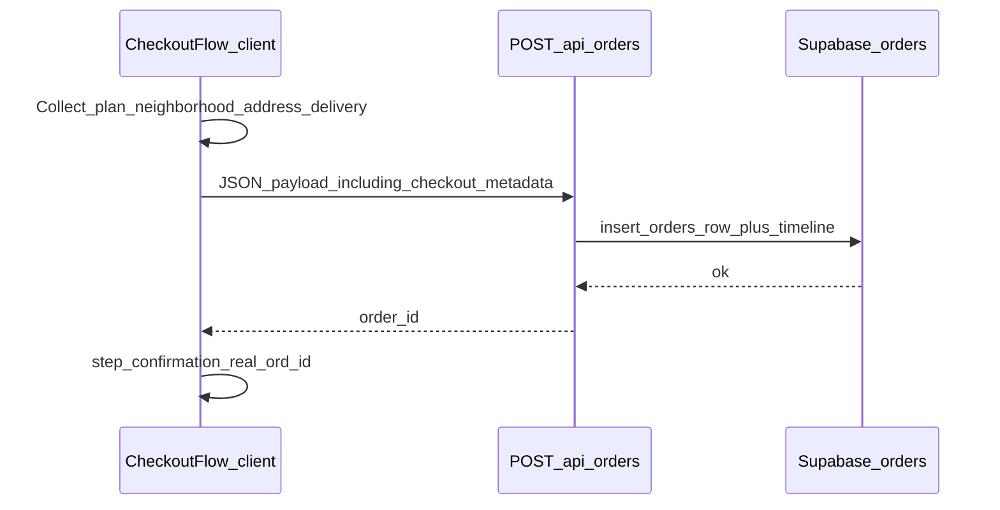

# Integrate design checkout + persist fields

## Context

- **Source UI**: [neighborhood-tasting-menu-design/src/components/checkout/](file:///Users/mikaelguillin/projects/neighborhood-tasting-menu-design/src/components/checkout/) (8 files) composed like [neighborhood-tasting-menu-design/src/routes/checkout.tsx](file:///Users/mikaelguillin/projects/neighborhood-tasting-menu-design/src/routes/checkout.tsx) (`CheckoutProvider`, stepper, steps, `OrderSummary`, `CheckoutConfirmation`).
- **Target app**: [apps/customer-web/src/app/checkout/page.tsx](file:///Users/mikaelguillin/projects/neighborhood-tasting-menu-2/apps/customer-web/src/app/checkout/page.tsx) currently uses [checkout-form.tsx](file:///Users/mikaelguillin/projects/neighborhood-tasting-menu-2/apps/customer-web/src/components/checkout-form.tsx), which already POSTs to `/api/orders` via [order-store.ts](file:///Users/mikaelguillin/projects/neighborhood-tasting-menu-2/apps/customer-web/src/lib/order-store.ts).
- **Database today**: `orders` has `address text`, `delivery_window text`, `payment_method` ([migration](file:///Users/mikaelguillin/projects/neighborhood-tasting-menu-2/supabase/migrations/202604251745_add_order_payment_method.sql)), `promo_code`, fees — **no** columns for neighborhood slug, delivery notes, gift fields, or structured address.
- **Your choice**: **Do not persist PAN/expiry/CVC**; treat payment step as demo UI and save `payment_method: 'card'` only.

## Architecture (high level)

## 1. Copy and adapt components

- Add folder [`apps/customer-web/src/components/checkout/`](file:///Users/mikaelguillin/projects/neighborhood-tasting-menu-2/apps/customer-web/src/components/checkout/) with the same structure as design:
  - `checkout-context.tsx`, `checkout-stepper.tsx`, `order-summary.tsx`, `checkout-confirmation.tsx`, `steps/step-*.tsx`.
- **Replace** TanStack-specific usage in [`checkout-confirmation.tsx`](file:///Users/mikaelguillin/projects/neighborhood-tasting-menu-design/src/components/checkout/checkout-confirmation.tsx): `Link` from `next/link` with `href="/"`, `href="/sign-in"`, and optionally `href="/orders"` for “manage”.
- **Replace** static [`@/data/plans`](file:///Users/mikaelguillin/projects/neighborhood-tasting-menu-design/src/data/plans.ts) / [`NEIGHBORHOODS`](file:///Users/mikaelguillin/projects/neighborhood-tasting-menu-design/src/data/neighborhoods.ts) imports:
  - **Plans**: Map [`PlanOption`](file:///Users/mikaelguillin/projects/neighborhood-tasting-menu-2/apps/customer-web/src/lib/catalog-types.ts) (from `GET /api/plans`) into the shape the UI expects (`slug` = `id`, display price from `priceCents`, `priceLabel`, perks from DB). Initialize context after plans load (see below).
  - **Neighborhoods**: Load via existing [`GET /api/neighborhoods`](file:///Users/mikaelguillin/projects/neighborhood-tasting-menu-2/apps/customer-web/src/app/api/neighborhoods/route.ts) with `borough=all`, high `pageSize`, `sort=featured` so the grid matches design intent while using **`image_url`** from Supabase (no need to copy design JPG assets).
- Add [`apps/customer-web/src/lib/dates.ts`](file:///Users/mikaelguillin/projects/neighborhood-tasting-menu-2/apps/customer-web/src/lib/dates.ts) by copying [`formatFriendlyDate` / `getNextFriday`](file:///Users/mikaelguillin/projects/neighborhood-tasting-menu-design/src/lib/dates.ts) (no design-repo dependency).

## 2. Checkout shell for Next.js

- Introduce a **client** wrapper (e.g. `checkout-flow.tsx` next to the components or under `app/checkout/`) that mirrors design’s `CheckoutInner`:
  - Reads search params: `plan`, `neighborhood`, `mode` (defaults aligned with design: e.g. `weekly`, first neighborhood slug from loaded list, `subscription`).
  - Fetches plans + neighborhoods; shows loading state until both are ready; then renders `CheckoutProvider` with resolved defaults.
  - Renders back link to `/plans` (design used TanStack `Link to="/plans"`).
- Update [`apps/customer-web/src/app/checkout/page.tsx`](file:///Users/mikaelguillin/projects/neighborhood-tasting-menu-2/apps/customer-web/src/app/checkout/page.tsx) to render this shell + keep existing metadata copy or align hero copy with design.

## 3. Context + payment submit behavior

- Refactor [`checkout-context.tsx`](file:///Users/mikaelguillin/projects/neighborhood-tasting-menu-design/src/components/checkout/checkout-context.tsx) types to use loaded plan/neighborhood lists instead of `getPlan()` from static data.
- Replace fake `completeOrder()` / random `NTM-…` id with:
  - `completeOrder` **async**: `fetch('/api/orders', { method: 'POST', body: … })`.
  - On **201**: set `orderId` from response to show on confirmation; set `step` to `confirmation`.
  - On **401**: surface “sign in required” with link to `/sign-in` (same behavior as current [`checkout-form.tsx`](file:///Users/mikaelguillin/projects/neighborhood-tasting-menu-2/apps/customer-web/src/components/checkout-form.tsx)).
  - **Do not** send card number/expiry/CVC in JSON; only `paymentMethod: 'card'`.
- [`step-payment.tsx`](file:///Users/mikaelguillin/projects/neighborhood-tasting-menu-design/src/components/checkout/steps/step-payment.tsx): keep client-side validation for UX; on submit call the new async completion path (loader state already present).

## 4. Payload mapping (what gets saved)

Build server-side strings from UI state:

- **`address` (existing column)**: Single multiline shipping block assembled from structured fields (name, street, apt, city, state, zip, phone) so ops/vendor views stay readable without UI changes.
- **`delivery_window` (existing column)**: Human label for the selected slot (e.g. “Friday, 4–6pm”) — map [`DeliveryWindow`](file:///Users/mikaelguillin/projects/neighborhood-tasting-menu-design/src/components/checkout/checkout-context.tsx) ids to the same labels used in [`step-delivery.tsx`](file:///Users/mikaelguillin/projects/neighborhood-tasting-menu-design/src/components/checkout/steps/step-delivery.tsx).
- **`payment_method`**: Always `'card'` for this flow (matches existing check constraint).
- **`promo_code`**: Optional — either add a small promo field to summary (parity with old form) or omit if you want strict design parity; recommend one optional input on summary/plan step so `WELCOME10` still works with [`moneyTotals`](file:///Users/mikaelguillin/projects/neighborhood-tasting-menu-2/apps/customer-web/src/lib/order-store.ts).

**Structured extras** (neighborhood slug, `subscription` vs `onetime`, delivery notes, gift flag/message, delivery window code, billing ZIP vs delivery, full structured address object): persist in **one new JSON column** on `orders` (see §5) so every input is queryable without cramming unstructured text into `delivery_window`.

## 5. Database migration

- Add a new Supabase migration under [`supabase/migrations/`](file:///Users/mikaelguillin/projects/neighborhood-tasting-menu-2/supabase/migrations/): e.g. `orders.checkout_metadata jsonb` (nullable for legacy rows). Store a stable JSON shape, e.g. `{ neighborhoodSlug, checkoutMode, address, delivery, paymentMeta: { sameAsDelivery, billingZip } }` — **exclude** card secrets.
- Extend [`createOrder`](file:///Users/mikaelguillin/projects/neighborhood-tasting-menu-2/apps/customer-web/src/lib/order-store.ts) `insert` to include `checkout_metadata`.
- Extend [`POST /api/orders`](file:///Users/mikaelguillin/projects/neighborhood-tasting-menu-2/apps/customer-web/src/app/api/orders/route.ts): validate `planId`, composed `address`, `deliveryWindow`, `paymentMethod`, optional `promoCode`, and optional `checkoutMetadata` object; reject oversize strings if needed.

## 6. Order summary parity with billing rules

- Update copied [`order-summary.tsx`](file:///Users/mikaelguillin/projects/neighborhood-tasting-menu-design/src/components/checkout/order-summary.tsx) so totals match backend: **subtotal** from selected plan’s `priceCents`, **delivery** free, **service fee** $4.00 (400 cents), **discount** when promo `WELCOME10`, **total** consistent with `moneyTotals` in `order-store.ts` (today’s [`checkout-form.tsx`](file:///Users/mikaelguillin/projects/neighborhood-tasting-menu-2/apps/customer-web/src/components/checkout-form.tsx) behavior).

## 7. Cleanup

- Switch `/checkout` to the new flow; **remove or stop exporting** [`checkout-form.tsx`](file:///Users/mikaelguillin/projects/neighborhood-tasting-menu-2/apps/customer-web/src/components/checkout-form.tsx) if nothing else imports it (delete only if unused).

## Files likely touched

| Area     | Files                                                                                                |
| -------- | ---------------------------------------------------------------------------------------------------- |
| New      | `apps/customer-web/src/components/checkout/**`, `lib/dates.ts`, checkout client shell, migration SQL |
| Update   | `app/checkout/page.tsx`, `app/api/orders/route.ts`, `lib/order-store.ts`                             |
| Optional | `DATABASE_SCHEMA.md` (only if you want docs in sync with the new column)                             |

## Risks / notes

- **Subscription vs one-time**: Store `checkoutMode` in metadata; creating a `subscriptions` row is a separate product decision — not implied by current `createOrder`.
- **Profile phone**: Optional enhancement — `PATCH /api/profile` with checkout phone on success (uses existing [`profile` route](file:///Users/mikaelguillin/projects/neighborhood-tasting-menu-2/apps/customer-web/src/app/api/profile/route.ts)); can be a follow-up.
