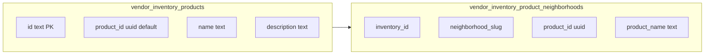

# Inventory products: name, description, auto product_id, combobox neighborhoods

## Data model

**Table [`vendor_inventory_products`](supabase/migrations/202605031200_vendor_inventory_products.sql)** (new migration, do not edit the old migration file):

- Add **`name text not null`** (vendor-facing label).
- Add **`description text`** nullable.
- Change **`product_id`** from vendor-chosen **text** to **`uuid not null default gen_random_uuid()`** (one stable id per row; generated on insert). Drop the existing **`unique (vendor_id, product_id)`** text constraint; replace with **`unique (product_id)`** (or primary uniqueness on uuid alone).
- Keep **`id text` primary key** (`inv_…`) for continuity with existing ops APIs and junction `inventory_id`, unless you prefer a follow-up to migrate PK to uuid (higher churn); default plan keeps `id` as the row key and uses **`product_id uuid`** as the public stable product reference.
- Backfill migration: set `name` from the current text `product_id` (human-readable slugs) before altering column type; then alter `product_id` to uuid with new defaults for any edge rows.

**Table [`vendor_inventory_product_neighborhoods`](supabase/migrations/202605031200_vendor_inventory_products.sql)**:

- Change **`product_id`** column to **`uuid`** to match the inventory table (denormalized copy of `vendor_inventory_products.product_id`).
- Add **`product_name text not null`** (denormalized from `vendor_inventory_products.name`) so [`customer-web` anon reads](apps/customer-web/src/lib/catalog-store.ts) can show human-readable lineup without joining RLS-protected inventory.
- **Trigger** (or extend the existing product_id sync trigger): on insert/update of **`name`** (and optionally description) on `vendor_inventory_products`, update all matching junction rows’ **`product_name`**.

**Customer web**: Update [`loadProductIdsByNeighborhoodSlug`](apps/customer-web/src/lib/catalog-store.ts) / [`listProductIdsForNeighborhoodSlug`](apps/customer-web/src/lib/catalog-store.ts) to `select('neighborhood_slug, product_name')` (or `product_id, product_name`) and build `Neighborhood.items` as **display strings** (recommend **`product_name`** values for the list and search haystack, consistent with today’s prose “items” UX). Adjust [`catalog-types.ts`](apps/customer-web/src/lib/catalog-types.ts) comment if `items` is now “product display names” rather than ids.

**Seed** ([`supabase/seed.sql`](supabase/seed.sql)): set `name` / `description`; remove manual text `product_id` values—let defaults apply, then insert junction rows with the actual uuid `product_id` from the inserted rows (use subselects or a small DO block).

**Docs** ([`DATABASE_SCHEMA.md`](DATABASE_SCHEMA.md)): document `name`, `description`, uuid `product_id`, and junction `product_name`.

## Vendor API and stores

- [`vendor-inventory-products-store.ts`](apps/vendor-portal/src/lib/vendor-inventory-products-store.ts): **`createVendorInventoryProduct(vendorId, { name, description?, neighborhoodSlugs? })`**—no `productId` argument; insert omits `product_id` so DB default applies. **`updateVendorInventoryProductMeta(vendorId, inventoryId, { name?, description? })`**; **remove** `updateVendorInventoryProductId`. List/select includes `name`, `description`, `product_id` (uuid) for internal use only if needed.
- [`vendor-ops-store.ts`](apps/vendor-portal/src/lib/vendor-ops-store.ts): extend **`InventoryItem`** with **`name`** (and optional **`description`**); map from DB; **`getInventoryItems`** / **`updateInventoryItem`** selects order by **`name`**. [`inventory-controls.tsx`](<apps/vendor-portal/src/app/(main)/dashboard/inventory/_components/inventory-controls.tsx>): primary label = **`name`**, optional muted line for **description** (truncate if long).
- API routes under [`apps/vendor-portal/src/app/api/vendor/inventory/products/`](apps/vendor-portal/src/app/api/vendor/inventory/products/): **POST** body `{ name, description?, neighborhoodSlugs? }`; **PATCH** `[id]` for **name/description only**; **DELETE** unchanged; **PUT** `neighborhoods` unchanged but server writes **`product_id` + `product_name`** into junction rows when replacing links.

## Vendor UI ([`inventory-products-manager.tsx`](<apps/vendor-portal/src/app/(main)/dashboard/inventory/_components/inventory-products-manager.tsx>))

- **Create / edit**: inputs for **name** (required) and **description** (optional textarea or Input); **remove** product id field and “Save id” flow.
- **Neighborhoods**: remove checkbox lists. Implement **“Add neighborhood”** using the existing [`combobox.tsx`](apps/vendor-portal/src/components/ui/combobox.tsx) (Base UI) **or** a **`Select`** from [`select.tsx`](apps/vendor-portal/src/components/ui/select.tsx): options = vendor-assigned slugs **not yet** linked to this product; on pick, **PUT** updated `slugs` array (append). Show current associations as **badges** with a remove (icon) button that PUTs without that slug—still no checkboxes.
- Sort products by **`name`** in the list.

## Diagram

## Testing

- `pnpm --filter vendor-portal typecheck`
- After migration + seed: vendor Inventory page create/edit; customer neighborhood detail shows names from junction.
