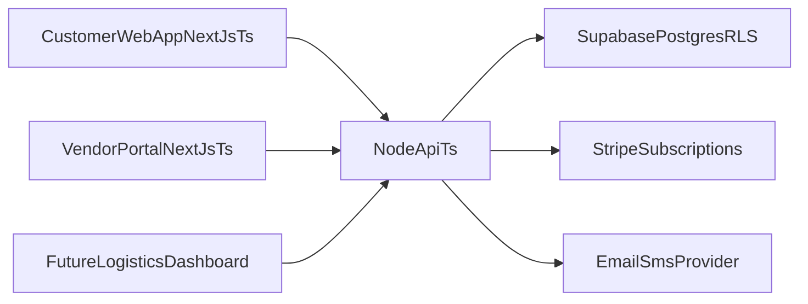

# Neighborhood Tasting Menu MVP Plan

## Recommendation: Node.js vs FastAPI

Use **Node.js with TypeScript** for this MVP.

Why this is the better fit for your selected scope:

- You get end-to-end TypeScript (frontend + backend), which reduces integration bugs and speeds delivery.
- Shared schema/types across customer app, vendor portal, and API are straightforward in a pnpm monorepo.
- Supabase JS tooling and auth/storage integration are smoother in a TS-first stack.
- Your chosen MVP (subscriptions, vendor inventory, payments, notifications) is CRUD/workflow-heavy, not ML-heavy.

When FastAPI would be better:

- If route optimization, forecasting, or data-science-heavy workloads become core early. In that case, add Python later as a focused service while keeping the Node core.

## Target Architecture

## Monorepo Structure

- `apps/customer-web`: Customer-facing subscription app (Next.js App Router + TS + shadcn/ui).
- `apps/vendor-portal`: Vendor management app (Next.js App Router + TS + shadcn/ui).
- `apps/api`: Node.js TypeScript backend (recommend NestJS or Fastify-based service).
- `packages/ui`: Shared shadcn/ui wrapper components + design tokens mapped from DESIGN.md.
- `packages/config`: Shared tsconfig, eslint, prettier, and env conventions.
- `packages/types`: Shared domain types and API DTOs.
- `supabase/`: SQL migrations, seed data, policies, and edge function configs if needed.

Workspace/package manager standard:

- Use `pnpm` as the only package manager for workspace installs, script execution, and CI commands.
- Keep all cross-app dependency changes workspace-aware (`pnpm -r`, filtered runs, shared lockfile).
- Avoid mixing `npm`/`yarn` commands in docs, scripts, or automation.

Component sharing policy:

- Do not assume all UI components are shared across both Next.js apps.
- Always shared: design tokens, lint/ts config, domain types.
- Conditionally shared: low-level primitives only when semantics and behavior are truly identical.
- App-local by default: workflow-specific components and product composites.

## Product Scope (MVP)

### Customer Web App

- Neighborhood/box discovery and detail pages.
- Subscription checkout and plan management.
- Account area: delivery preferences, billing status, pause/resume/cancel.
- Notification preferences and timeline (order/renewal/delivery updates).

### Vendor Portal

- Vendor onboarding/profile.
- Product catalog and availability windows.
- Pre-order commitments and inventory updates per cycle.
- Order fulfillment status and simple analytics (units, revenue, sell-through).

### Platform Services

- Recurring billing + webhook handling (payments, invoice events, failed payment recovery).
- Notifications for lifecycle events (email first, SMS optional).
- Auth + RBAC for customer/vendor roles.

### Deferred to Phase 2

- Dedicated logistics dashboard (route planning/drop density UI).
- Optimization engine beyond basic fulfillment batching.

## Supabase Data Model (Initial)

Core tables/entities:

- `users` (mapped to auth identities + profile metadata).
- `vendors` and `vendor_users` (membership + roles).
- `products` (vendor-owned catalog, availability, unit constraints).
- `boxes` and `box_items` (curated neighborhood collections).
- `subscriptions` (plan, cadence, status, renewal dates).
- `orders` and `order_items` (cycle snapshots).
- `deliveries` (address, window, status, proof fields).
- `payments` and `billing_events` (Stripe references + webhook audit trail).
- `notifications` (channel, template, send status, retries).

Policy strategy:

- Row Level Security on all business tables.
- Customers can only read/write their own subscription/order data.
- Vendors can only manage their own catalog/inventory/fulfillment.
- Service role only for webhook processing and system jobs.

## Design System Implementation (From DESIGN.md)

Create a design-token layer in `packages/ui` and enforce these non-negotiables:

- Warm canvas surfaces (`#f2f0eb`, `#edebe9`) as default page backgrounds.
- Four-tier green mapping by role (heading vs CTA vs dark band).
- Universal pill buttons (`50px` radius) with active `scale(0.95)`.
- Layered soft shadows (avoid single heavy drop shadow).
- Typography substitutes (Inter/Manrope) with tight tracking.

Implementation approach:

- Define CSS variables/Tailwind theme extensions for color tiers, spacing scale, radii, elevation tokens.
- Build shared primitives (`Button`, `Card`, `FeatureBand`, `FloatingActionButton`, form fields).
- Add visual regression/story examples for core components before app-level page assembly.

## Backend Plan (Node.js TypeScript)

Preferred stack:

- Node.js + TypeScript API (NestJS recommended for modular domains and testability).
- `zod` for runtime validation and shared schema typing.
- Background job runner (e.g., BullMQ or lightweight queue) for notifications/webhooks retries.

Domain modules:

- `auth`: session handling and role claims.
- `subscriptions`: plan lifecycle + cadence operations.
- `vendors`: catalog and inventory workflows.
- `orders`: cycle generation and status transitions.
- `billing`: Stripe integration + webhook reconciliation.
- `notifications`: templates, dispatch, retry policy.

## Delivery Phases

### Phase 0: Foundation

- Initialize pnpm workspace and app/package layout (`apps/*` + `packages/*`).
- Set up CI, linting, type checks, env management, and baseline tests.
- Bootstrap Supabase project and migration workflow.

### Phase 1: Design System + Auth

- Implement shared tokens/components from DESIGN.md.
- Set up Supabase Auth and role claims for customer/vendor.
- Deliver core layouts/navigation for both apps.

### Phase 2: Customer Subscription Flow

- Build box discovery, plan selection, checkout, and account management.
- Integrate recurring billing and webhook-driven status updates.

### Phase 3: Vendor Operations

- Build catalog/inventory/pre-order management.
- Add fulfillment status views and cycle visibility.

### Phase 4: Notifications + Hardening

- Add lifecycle notification triggers and delivery.
- Improve observability, retries, audit trails, and access controls.
- QA pass, accessibility pass, and launch readiness checklist.

## Success Criteria

- Two production-deployable web apps in one pnpm monorepo.
- All key MVP workflows working end-to-end with Supabase + billing + notifications.
- UI consistently follows DESIGN.md token and component rules.
- Logistics dashboard explicitly tracked as next-phase scope, not MVP creep.
