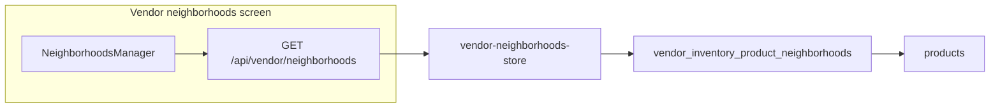

# Show products per neighborhood (vendor portal)

## Context

- Route: [`apps/vendor-portal/src/app/(main)/dashboard/neighborhoods/page.tsx`](<apps/vendor-portal/src/app/(main)/dashboard/neighborhoods/page.tsx>) renders [`NeighborhoodsManager`](<apps/vendor-portal/src/app/(main)/dashboard/neighborhoods/_components/neighborhoods-manager.tsx>).
- Today, [`GET /api/vendor/neighborhoods`](apps/vendor-portal/src/app/api/vendor/neighborhoods/route.ts) returns only `catalog` and `assignedSlugs` from [`vendor-neighborhoods-store.ts`](apps/vendor-portal/src/lib/vendor-neighborhoods-store.ts).
- Product–neighborhood links for the signed-in vendor live in **`vendor_inventory_product_neighborhoods`** with FK to **`products`** (see [`supabase/migrations/202605051200_products_catalog.sql`](supabase/migrations/202605051200_products_catalog.sql)). The inventory layer already reads this junction in [`listVendorInventoryProductsWithNeighborhoods`](apps/vendor-portal/src/lib/vendor-inventory-products-store.ts) (product-centric); the neighborhoods page needs the **inverse index: neighborhood → products**.

## Implementation

1. **Store helper** — In [`vendor-neighborhoods-store.ts`](apps/vendor-portal/src/lib/vendor-neighborhoods-store.ts), add something like `listVendorProductsByNeighborhoodSlug(vendorId: string)` that:
   - Queries `vendor_inventory_product_neighborhoods` with `.eq("vendor_id", vendorId)` and a nested select, e.g. `select("neighborhood_slug, products(id, name)")`, matching the pattern used in [`vendor-inventory-products-store.ts`](apps/vendor-portal/src/lib/vendor-inventory-products-store.ts) for embedded `products`.
   - Builds a **`Record<string, { id: string; name: string }[]>`** (or ordered array per slug): group by `neighborhood_slug`, dedupe by `product` `id`, sort each list by `name` (localeCompare).
   - Handles Supabase’s occasional array-or-single shape for nested `products` the same way as the inventory store (`Array.isArray` guard).

2. **API** — In [`route.ts`](apps/vendor-portal/src/app/api/vendor/neighborhoods/route.ts) `GET`, run the new helper in parallel with existing `Promise.all` and add a field to the JSON body, e.g. `productsByNeighborhood: Record<string, Array<{ id: string; name: string }>>`. No new routes required.

3. **UI** — In [`neighborhoods-manager.tsx`](<apps/vendor-portal/src/app/(main)/dashboard/neighborhoods/_components/neighborhoods-manager.tsx>):
   - Extend `NeighborhoodsPayload` with the new field; `load()` already replaces state from `GET`.
   - In the **“Your neighborhoods”** list, under each assigned row (after tagline / metadata), render the product list for that `slug`:
     - If non-empty: compact list (e.g. small muted text + bullet or comma-separated names) using stable `key={product.id}`.
     - If empty: short helper line pointing users to **Inventory** to link products (copy consistent with existing page tone).
   - Keep assign/unassign behavior unchanged; after mutations, `load()` refreshes both assignments and product groupings.

## Notes / edge cases

- **Unassign** does not delete `vendor_inventory_product_neighborhoods` rows today; orphaned links may exist. The UI only shows neighborhoods in **assigned** list, so those rows simply won’t appear until the vendor re-assigns—no schema change required for this story.
- RLS: junction `select` is allowed; **`products`** is readable for vendor members via existing policies (`products_select_vendor_member` in the migration above).

## Scope

- Files touched: [`vendor-neighborhoods-store.ts`](apps/vendor-portal/src/lib/vendor-neighborhoods-store.ts), [`route.ts`](apps/vendor-portal/src/app/api/vendor/neighborhoods/route.ts), [`neighborhoods-manager.tsx`](<apps/vendor-portal/src/app/(main)/dashboard/neighborhoods/_components/neighborhoods-manager.tsx>).
