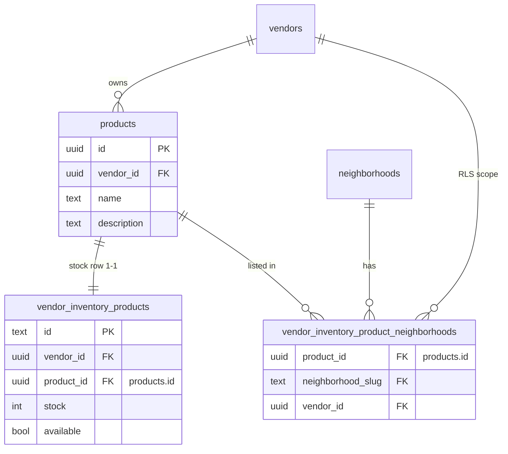

# Normalize catalog: `products` table + slim junction

## Target data model

- **`products`**: `id uuid` PK (`default gen_random_uuid()`), `vendor_id`, `name text not null`, `description text`, `created_at` / `updated_at`. This is the only place for **world-readable** `name` / `description`.
- **`vendor_inventory_products`**: remove **`name`** and **`description`**; keep `id` (text, ops), `vendor_id`, stock/availability columns; **`product_id uuid not null references public.products(id) on delete cascade`** (reuse today’s uuid values by backfilling `products` with those ids). Keep **unique `(vendor_id, product_id)`** or rely on 1:1 and unique `product_id` as today—pick one consistent constraint (recommend **unique(`product_id`)** if strictly one inventory row per product).
- **`vendor_inventory_product_neighborhoods`**: replace shape with **`(product_id uuid references products(id) on delete cascade, neighborhood_slug, vendor_id)`** and **`primary key (product_id, neighborhood_slug)`**. Drop **`product_name`** and **`inventory_id`**. Keeps vendor-scoped RLS unchanged in spirit (still `vendor_users` checks on `vendor_id`).

## Migration (new file under `supabase/migrations/`)

1. **`create table public.products`** as above; enable RLS.
2. **Backfill** `products` from current `vendor_inventory_products` (`insert … select distinct on (product_id) vendor_id, name, description, product_id as id` or equivalent) so existing UUIDs remain stable.
3. **Drop** trigger `trg_vendor_inventory_products_name` and function `sync_vendor_inventory_name_to_junction` (no more denormalized name on junction).
4. **Rebuild junction**: save data via temp table or `insert into new_junction select distinct j.neighborhood_slug, i.product_id, j.vendor_id from … join vendor_inventory_products i on i.id = j.inventory_id`; drop old table; rename/create final table + index on `neighborhood_slug`.
5. **Alter `vendor_inventory_products`**: drop columns `name`, `description`; add FK `product_id` → `products(id)` (already populated from backfill); ensure `on delete cascade` from `products` to inventory so deleting a catalog product clears stock + links.
6. **RLS on `products`**:
   - **`SELECT` for `anon` / `authenticated`**: `using (exists (select 1 from public.vendor_inventory_product_neighborhoods j where j.product_id = products.id))` so only products **linked to at least one neighborhood** are readable (matches your requirement; discovery search still works because those names appear in junction-backed lists).
   - **`INSERT` / `UPDATE` / `DELETE` for vendors**: same pattern as other vendor tables—`using` / `with check` via `vendor_users` and `products.vendor_id`.
7. **Grants**: mirror other public tables if your Supabase project requires explicit `grant` (often optional).

## Application changes

### Vendor server/store ([`vendor-inventory-products-store.ts`](apps/vendor-portal/src/lib/vendor-inventory-products-store.ts))

- **`createVendorInventoryProduct`**: `insert` into **`products`** (name, description, vendor_id) → use returned **`id`**; then `insert` into **`vendor_inventory_products`** (`id`, `vendor_id`, `product_id`, stock defaults); then insert junction rows **`(product_id, neighborhood_slug, vendor_id)`** only (no `product_name`, no `inventory_id`).
- **`updateVendorInventoryProductMeta`**: `update products set name, description where id = … and vendor_id = …` (lookup `product_id` from inventory row or pass product uuid in API).
- **`replaceNeighborhoodLinks`**: delete/insert junction rows keyed by **`product_id`** + `vendor_id`; drop `productName` argument.
- **`listVendorInventoryProductsWithNeighborhoods`**: `select` from `vendor_inventory_products` with embedded **`products (id, name, description)`** (or explicit join) and junction filtered by `product_id` instead of `inventory_id`.

### Vendor ops ([`vendor-ops-store.ts`](apps/vendor-portal/src/lib/vendor-ops-store.ts))

- Replace `.select("id,product_id,name,description,...")` with nested **`products (name, description)`** (and keep `product_id` for internal id); map **`toInventoryItem`** from nested shape; **`order`** by `products.name` (PostgREST ordering on foreign table as supported, or sort client-side).

### Vendor DELETE ([`vendor-inventory-products-store.ts`](apps/vendor-portal/src/lib/vendor-inventory-products-store.ts) / route)

- After schema, deleting the “product” from the UI should **`delete from products where id = (select product_id from vendor_inventory_products where vendor_id = ? and id = ?)`** (CASCADE removes inventory + junction) **or** delete inventory then orphan-delete product in one transaction—prefer single **`delete products`** when 1:1.

### Customer web ([`catalog-store.ts`](apps/customer-web/src/lib/catalog-store.ts))

- Replace reads of `product_name` from the junction with either:
  - **Embedded select**: `from('vendor_inventory_product_neighborhoods').select('neighborhood_slug, products(name)')` (RLS on `products` ensures only linked products resolve), then build `Neighborhood.items` as **`string[]` of `name`**; or
  - Two-step: junction `product_id` list per slug, then `products` `in()` filter (RLS still applies).

Search haystack continues to use `neighborhood.items` strings (product names).

### Seed & docs

- [`supabase/seed.sql`](supabase/seed.sql): insert **`products`** rows first; inventory rows reference `product_id`; junction rows without `product_name` / `inventory_id`.
- [`DATABASE_SCHEMA.md`](DATABASE_SCHEMA.md): document `products`, updated `vendor_inventory_products` (no name/description), slim junction, RLS summary.

## UI

Per your note: **no UI redesign** unless a field path changes—only wiring if API payloads shift (e.g. responses still expose `name` / `description` to the existing manager).

## Verification

- `pnpm --filter vendor-portal typecheck` and customer-web typecheck where touched.
- Local `supabase db reset` (or migration up): vendor Inventory CRUD; customer neighborhood detail still lists product names; anon cannot select a `products` row that has zero junction rows.
