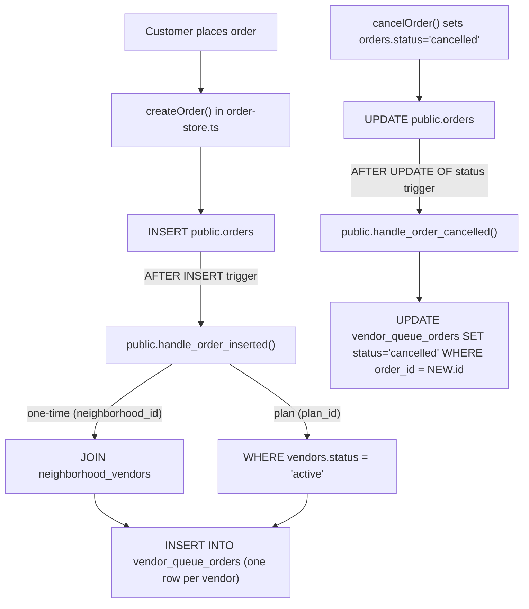

# Auto-Populate `vendor_queue_orders` on Order Insert + Cancellation Propagation

## Scope

- **v1 (this plan)**: insert fan-out on `orders` insert, plus **cancellation-only** propagation from `orders` to `vendor_queue_orders`.
- **v2 (deferred)**: full bidirectional status mapping for `payment_confirmed / in_preparation / out_for_delivery / delivered`. See "Out of scope" below.

## Why a DB trigger (not app code)

- `vendor_queue_orders` has **no `INSERT` RLS policy** today (see [`supabase/migrations/202604251320_core_flows_schema.sql`](supabase/migrations/202604251320_core_flows_schema.sql) L198–L216), so a customer session can't insert from the client.
- Triggers on `public.orders` make the fan-out **atomic** with the order insert and run regardless of whether `createOrder` (app) or seeds insert the order.
- Pattern already used in this repo: see `public.handle_auth_user_created()` (`SECURITY DEFINER`) in [`202604251320_core_flows_schema.sql`](supabase/migrations/202604251320_core_flows_schema.sql) L120–L140.

## Fan-out rules

- **One-time orders** (`neighborhood_id is not null`): one queue row per vendor in `public.neighborhood_vendors` for that slug.
- **Plan/subscription orders** (`plan_id is not null`): one queue row per **active** vendor (`vendors.status = 'active'`).
- Defaults per row:
  - `id` = `'q_' || substr(replace(gen_random_uuid()::text,'-',''),1,12)` (matches `q_xxxx` text-id style used in [`supabase/seed.sql`](supabase/seed.sql) L284–L287)
  - `due_at` = `new.created_at + interval '90 minutes'`
  - `sla_minutes_remaining` = `90` (read path already recomputes via `computeSlaMinutesRemaining` in [`apps/vendor-portal/src/lib/vendor-ops-store.ts`](apps/vendor-portal/src/lib/vendor-ops-store.ts) L25–L27)
  - `status` = `'new'`
  - `priority` = `'medium'`

## Architecture



## Files

### New migration: `supabase/migrations/202605090900_vendor_queue_autopopulate.sql`

Skeleton:

```sql
create or replace function public.handle_order_inserted()
returns trigger
language plpgsql
security definer
set search_path = public
as $$
begin
  if new.neighborhood_id is not null then
    insert into public.vendor_queue_orders
      (id, vendor_id, order_id, due_at, sla_minutes_remaining, status, priority)
    select
      'q_' || substr(replace(gen_random_uuid()::text, '-', ''), 1, 12),
      nv.vendor_id,
      new.id,
      new.created_at + interval '90 minutes',
      90,
      'new',
      'medium'
    from public.neighborhood_vendors nv
    where nv.neighborhood_slug = new.neighborhood_id;
  elsif new.plan_id is not null then
    insert into public.vendor_queue_orders
      (id, vendor_id, order_id, due_at, sla_minutes_remaining, status, priority)
    select
      'q_' || substr(replace(gen_random_uuid()::text, '-', ''), 1, 12),
      v.id,
      new.id,
      new.created_at + interval '90 minutes',
      90,
      'new',
      'medium'
    from public.vendors v
    where v.status = 'active';
  end if;
  return new;
end;
$$;

drop trigger if exists on_order_inserted on public.orders;
create trigger on_order_inserted
after insert on public.orders
for each row execute procedure public.handle_order_inserted();
```

Notes:

- `SECURITY DEFINER` is required because end-user sessions can't INSERT into `vendor_queue_orders` under existing RLS.
- No unique constraint on `(order_id, vendor_id)` is added: it would conflict with the seed which intentionally inserts 3 demo rows for the same `(ord_demo_weekly, vendor)` to showcase mixed statuses ([`supabase/seed.sql`](supabase/seed.sql) L284–L287). Order inserts only happen once per id, so duplicate triggering is not a concern.

### Seed compatibility check: `supabase/seed.sql`

- The order `ord_demo_weekly` is a plan order ([`supabase/seed.sql`](supabase/seed.sql) L249–L264) and is currently the only order seeded. Inserting it after the trigger exists will fan out one queue row to **every active vendor**.
- The 3 manual `q_1001`/`q_1002`/`q_1003` rows for vendor `33333333-...` will still apply via `on conflict (id) do nothing`, so demo variety is preserved.
- Net effect: the demo vendor will end up with **4 queue rows** (1 trigger row + 3 manual). That is acceptable for a dev seed; if you want only the manual demo rows, add `where new.id <> 'ord_demo_weekly'` to the trigger function or skip the trigger when the order id is in a demo allowlist. Will only adjust if you ask.

### New migration: `supabase/migrations/202605090910_vendor_queue_cancellation.sql`

Two coupled changes in one migration:

1. Extend `vendor_queue_orders.status` check to allow `'cancelled'`. The current constraint comes from [`supabase/migrations/202604251320_core_flows_schema.sql`](supabase/migrations/202604251320_core_flows_schema.sql) L96.
2. Add `public.handle_order_cancelled()` (`SECURITY DEFINER`) and an `AFTER UPDATE OF status` trigger on `public.orders` that flips matching queue rows to `cancelled`.

Skeleton:

```sql
alter table public.vendor_queue_orders
  drop constraint if exists vendor_queue_orders_status_check;

alter table public.vendor_queue_orders
  add constraint vendor_queue_orders_status_check
  check (status in ('new', 'confirmed', 'preparing', 'ready', 'fulfilled', 'cancelled'));

create or replace function public.handle_order_cancelled()
returns trigger
language plpgsql
security definer
set search_path = public
as $$
begin
  if new.status = 'cancelled' and old.status is distinct from 'cancelled' then
    update public.vendor_queue_orders
       set status = 'cancelled',
           updated_at = now()
     where order_id = new.id
       and status <> 'cancelled';
  end if;
  return new;
end;
$$;

drop trigger if exists on_order_cancelled on public.orders;
create trigger on_order_cancelled
after update of status on public.orders
for each row execute procedure public.handle_order_cancelled();
```

Why this shape:

- Fires only on the cancellation transition (`old <> cancelled` AND `new = cancelled`); avoids re-firing on unrelated `orders` updates.
- `SECURITY DEFINER` bypasses the customer-session RLS that would otherwise block writes to `vendor_queue_orders` (no INSERT policy + restricted UPDATE policy).
- Idempotent: re-cancelling an already-cancelled order is a no-op via the `status <> 'cancelled'` guard.
- Terminal: queue rows in `cancelled` are not reverted by this trigger; reactivation would be a separate v2 decision.

### Vendor portal updates for the new `cancelled` queue status

Three small touchpoints in [`apps/vendor-portal/`](apps/vendor-portal):

- [`apps/vendor-portal/src/lib/vendor-ops-store.ts`](apps/vendor-portal/src/lib/vendor-ops-store.ts) L1: extend the type union — `export type QueueStatus = "new" | "confirmed" | "preparing" | "ready" | "fulfilled" | "cancelled";`.
- [`apps/vendor-portal/src/app/api/vendor/ops/queue/[id]/status/route.ts`](apps/vendor-portal/src/app/api/vendor/ops/queue/[id]/status/route.ts) L6: keep `VALID_STATUSES` to the **5 vendor-operable** values — do **not** add `cancelled` here, so vendors cannot manually set or unset it from the UI. Add an early 409/403 short-circuit when the existing row is already `cancelled`:

```ts
if (updated === null) {
  return NextResponse.json({ error: "Queue item not found" }, { status: 404 });
}
```

Adjust `updateQueueStatus` to refuse updates when the current row is already `cancelled` (filter on `status <> 'cancelled'` in the `.update()` chain or pre-check) and surface a 409 from the API.

- [`apps/vendor-portal/src/app/(main)/dashboard/default/_components/queue-priorities.tsx`](<apps/vendor-portal/src/app/(main)/dashboard/default/_components/queue-priorities.tsx>):
  - Keep `STATUS_OPTIONS` (L16) at the 5 operable values; render `cancelled` as a read-only badge with the `Select` and `Sync` button disabled when `item.status === "cancelled"`.
  - Add a tone for `cancelled` in `statusTone` (e.g. `secondary` or `outline`).

### Doc update: `DATABASE_SCHEMA.md`

- Under §1 add bullets for both new triggers/functions next to `handle_auth_user_created` (around L91–L97 of [`DATABASE_SCHEMA.md`](DATABASE_SCHEMA.md)):
  - `on_order_inserted` / `handle_order_inserted()` — fan-out on insert.
  - `on_order_cancelled` / `handle_order_cancelled()` — cancellation propagation.
- Update the `vendor_queue_orders.status` enum value list to include `cancelled`.

### App code: no changes to `createOrder` or `cancelOrder`

`createOrder()` and `cancelOrder()` in [`apps/customer-web/src/lib/order-store.ts`](apps/customer-web/src/lib/order-store.ts) (L253–L348 and L354–L396 respectively) stay as-is. Both already perform the underlying `orders` write that the triggers hook into. The vendor read path in [`apps/vendor-portal/src/lib/vendor-ops-store.ts`](apps/vendor-portal/src/lib/vendor-ops-store.ts) (L72–L87) returns the new rows automatically once the type union is extended.

## Out of scope (v2)

- Auto-mapping non-cancellation order statuses (`payment_confirmed`, `in_preparation`, `out_for_delivery`, `delivered`) onto queue rows — needs precedence rules vs. vendor manual transitions and is intentionally deferred.
- Reactivating a `cancelled` queue row when an order is restored (no current product flow restores cancelled orders).
- Per-vendor `item_count`/customer-name display: those columns were just dropped in [`202605080930_vendor_queue_drop_display_columns.sql`](supabase/migrations/202605080930_vendor_queue_drop_display_columns.sql); display fields should join `orders` / `users` on the read path instead.
- Smarter `due_at` derived from `delivery_window` text.
- Smarter `priority` heuristics.

## Verification

1. Run `supabase db reset` (or apply the two new migrations) on the local stack.
2. Place an order via customer-web checkout for a neighborhood with at least one vendor in `neighborhood_vendors`.
3. SQL check: `select id, vendor_id, order_id, status from public.vendor_queue_orders where order_id = '<new id>';` — expect one row per vendor in that neighborhood.
4. Place a plan-mode order; expect one row per `vendors.status = 'active'`.
5. Open the vendor portal queue screen; confirm new rows appear under the corresponding vendor accounts.
6. Cancel the order via customer-web (`cancelOrder`); SQL check: `select status from public.vendor_queue_orders where order_id = '<id>';` — all rows should be `cancelled`. Vendor portal should show those rows as read-only.
7. Try to update a `cancelled` queue row from the vendor portal — expect a non-200 response and no DB change.
