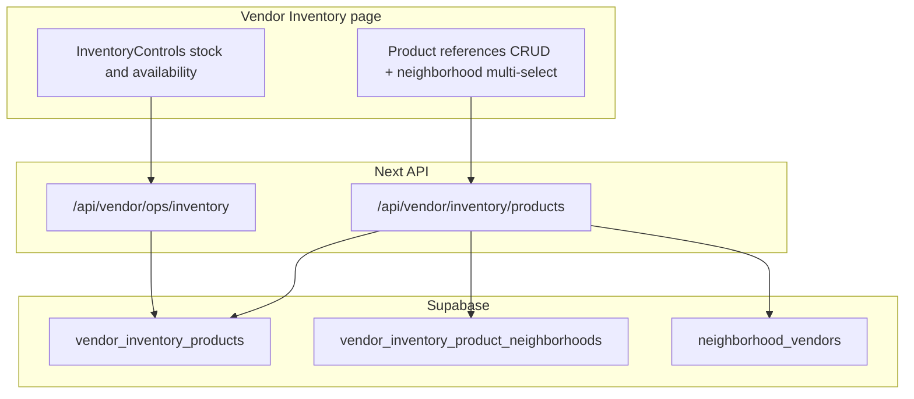

# Vendor Inventory screen and inventory/neighborhood schema

## Current state (relevant)

- **Orders** lives at [`apps/vendor-portal/src/app/(main)/dashboard/default/page.tsx`](<apps/vendor-portal/src/app/(main)/dashboard/default/page.tsx>) and renders [`ops-dashboard.tsx`](<apps/vendor-portal/src/app/(main)/dashboard/default/_components/ops-dashboard.tsx>), which includes [`InventoryControls`](<apps/vendor-portal/src/app/(main)/dashboard/default/_components/inventory-controls.tsx>) and still loads inventory for [`OpsMetricCards`](<apps/vendor-portal/src/app/(main)/dashboard/default/_components/ops-metric-cards.tsx>) (low-stock / unavailable counts).
- Inventory is loaded via [`vendor-ops-store.ts`](apps/vendor-portal/src/lib/vendor-ops-store.ts) from table `vendor_inventory_items` (columns include `name`, no `product_id` in DB today). RLS in [`202604251320_core_flows_schema.sql`](supabase/migrations/202604251320_core_flows_schema.sql) only allows **select** and **update** for vendor members — no insert/delete for app users.
- `neighborhoods` defines `items text[]` in the same migration; [`catalog-store.ts`](apps/customer-web/src/lib/catalog-store.ts) selects `items` and [`neighborhoods/[slug]/page.tsx`](apps/customer-web/src/app/neighborhoods/[slug]/page.tsx) renders “In the box” from `n.items`. There is **no** `products` table in migrations yet.

## 1) Database migration (new file under `supabase/migrations/`)

**Rename inventory table and column**

- `alter table public.vendor_inventory_items rename to vendor_inventory_products;`
- Rename index `idx_vendor_inventory_items_vendor_available` → `idx_vendor_inventory_products_vendor_available` (or drop/create with same definition).
- Add `product_id text not null`:
  - For existing rows: backfill `product_id` from former `name` (one-time), then `drop column name`.
- Add **`unique (vendor_id, product_id)`** so a vendor cannot duplicate the same product reference.

**Neighborhoods: drop `items`**

- `alter table public.neighborhoods drop column items;`

**Junction: vendor product ↔ neighborhood (drives “linked with product ids”)**

Because [`customer-web` uses the anon key](apps/customer-web/src/lib/supabase-server.ts), anon users **cannot** join through RLS-protected inventory to discover `product_id`. The junction table should **denormalize** fields needed for public read:

- Suggested table: `public.vendor_inventory_product_neighborhoods`
  - `inventory_id text not null` → `vendor_inventory_products(id)` **on delete cascade**
  - `neighborhood_slug text not null` → `neighborhoods(slug)` **on delete cascade**
  - `vendor_id uuid not null` → `vendors(id)` **on delete cascade**
  - `product_id text not null` (copy of parent row’s `product_id` at write time)
  - **Primary key** `(inventory_id, neighborhood_slug)`
  - Optional: composite index on `(neighborhood_slug)` for customer queries.

**RLS**

- **Vendors** (via `vendor_users`): `select/insert/update/delete` on the junction where `vendor_id` matches membership (mirror patterns used for [`vendor_queue_orders`](supabase/migrations/202604251320_core_flows_schema.sql)).
- **Public read** for discovery: `select` **for all roles** on the junction (or `to anon, authenticated`) so customer pages can `select('product_id, vendor_id').eq('neighborhood_slug', slug)` without accessing stock.
- **Inventory table**: add **`insert` and `delete`** policies for vendor members (in addition to existing select/update). Optionally rename policies for clarity after table rename (PostgreSQL keeps policy names when renaming the table).

**Integrity**

- Enforce “vendor only assigns neighborhoods they belong to”: either in API (compare against `neighborhood_vendors`) or a `check`/trigger — **API validation** against existing [`vendor-neighborhoods-store`](apps/vendor-portal/src/lib/vendor-neighborhoods-store.ts) / `neighborhood_vendors` is the lightest approach.
- On **`vendor_inventory_products` update of `product_id`**: update matching junction rows (DB trigger) so public listings stay consistent.

**Seed**

- Update [`supabase/seed.sql`](supabase/seed.sql): remove `items` from `insert into public.neighborhoods (...)` and from `on conflict` updates; change `vendor_inventory_items` inserts to `vendor_inventory_products` with `product_id` (map from old `name` values or use stable ids); optionally seed a few junction rows for demo neighborhoods.

**Docs**

- Refresh [`DATABASE_SCHEMA.md`](DATABASE_SCHEMA.md) sections for `vendor_inventory_items`, `neighborhoods`, indexes, and relationship overview.

## 2) Vendor portal — new Inventory screen

**Routing and nav**

- Add [`apps/vendor-portal/src/app/(main)/dashboard/inventory/page.tsx`](<apps/vendor-portal/src/app/(main)/dashboard/inventory/page.tsx>) (same layout pattern as [`neighborhoods/page.tsx`](<apps/vendor-portal/src/app/(main)/dashboard/neighborhoods/page.tsx>)).
- Extend [`sidebar-items.ts`](apps/vendor-portal/src/navigation/sidebar/sidebar-items.ts) and [`search-dialog.tsx`](<apps/vendor-portal/src/app/(main)/dashboard/_components/sidebar/search-dialog.tsx>) with an **Inventory** entry (e.g. `Package` icon, URL `/dashboard/inventory`).

**Move `InventoryControls`**

- Physically move the component to e.g. `dashboard/inventory/_components/inventory-controls.tsx` (or a shared `_components` folder if you prefer). Update imports.
- **Display label**: the control currently uses `item.name` ([`inventory-controls.tsx`](<apps/vendor-portal/src/app/(main)/dashboard/default/_components/inventory-controls.tsx>)); after schema change, bind labels to `product_id` (and optionally a formatted subtitle).

**Page layout**

- **Top**: new client component (e.g. `inventory-products-manager.tsx`) for **CRUD** on `vendor_inventory_products` and **multi-select neighborhoods** per product (only slugs the vendor already has in `neighborhood_vendors`). UX can mirror [`NeighborhoodsManager`](<apps/vendor-portal/src/app/(main)/dashboard/neighborhoods/_components/neighborhoods-manager.tsx>): cards, badges, async mutations, error alert.
- **Bottom**: `<InventoryControls />` with the same `fetch('/api/vendor/ops/inventory')` + refresh contract as today.

**API / server layer**

- Point all Supabase `.from(...)` calls from `vendor_inventory_items` → `vendor_inventory_products` and selects from `name` → `product_id`.
- Extend [`vendor-ops-store.ts`](apps/vendor-portal/src/lib/vendor-ops-store.ts) (or a sibling module) with `createInventoryProduct`, `deleteInventoryProduct`, `listInventoryProductsWithNeighborhoods`, and `setProductNeighborhoods` (transactional: replace junction rows for one `inventory_id`).
- Add route handlers under e.g. [`apps/vendor-portal/src/app/api/vendor/inventory/`](apps/vendor-portal/src/app/api/vendor/) (REST shape is up to you; keep existing [`ops/inventory/*`](apps/vendor-portal/src/app/api/vendor/ops/inventory/) routes working by delegating to the same store functions **or** move handlers and update `InventoryControls` fetch URLs once — prefer **one** canonical path to avoid drift).

**Orders screen**

- Remove `<InventoryControls />` from [`ops-dashboard.tsx`](<apps/vendor-portal/src/app/(main)/dashboard/default/_components/ops-dashboard.tsx>); keep `loadInventory` if metrics still need it.
- Update [`default/page.tsx`](<apps/vendor-portal/src/app/(main)/dashboard/default/page.tsx>) copy so “inventory controls” is no longer promised on Orders.

## 3) Customer web (and mock API) after dropping `neighborhoods.items`

- [`catalog-store.ts`](apps/customer-web/src/lib/catalog-store.ts): stop selecting `items` from `neighborhoods`. Load assignments from `vendor_inventory_product_neighborhoods` (second query or batched), build `Neighborhood.items` as **`string[]` of `product_id`** (or map to display strings later). Update text search to include those ids instead of the old `items` array.
- [`getNeighborhoodBySlug`](apps/customer-web/src/lib/catalog-store.ts): same merge so detail pages still get a list for “In the box”.
- [`apps/api/src/index.ts`](apps/api/src/index.ts): keep mock `items` as **`[]`** or remove the field from the zod schema and handlers if unused — align with the DB shape so clients do not assume prose descriptions in `items`.

## 4) `product_id` type note

There is **no** `products` table in migrations today. The migration should use **`product_id text not null`** (vendor-defined stable id). If you later add a `products` table, you can migrate to `uuid` + FK in a follow-up migration.
