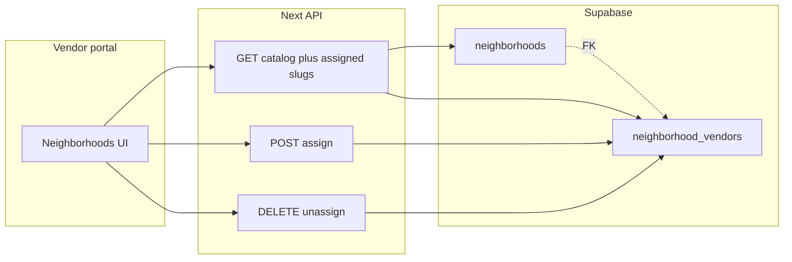

# Vendor portal: Neighborhoods (assign / unassign)

## Scope

**In scope:** One screen where the signed-in vendor **assigns** themselves to an existing neighborhood (add a `neighborhood_vendors` row) or **unassigns** (delete that row). The UI only offers neighborhoods that already exist in the catalog and pass the NYC borough filter (see below).

**Out of scope:** Creating, editing, or deleting rows in **`public.neighborhoods`**. That table is platform-curated; RLS only allows **`SELECT`** for authenticated users (`neighborhoods_read_all` in [`supabase/migrations/202604251320_core_flows_schema.sql`](/Users/mikaelguillin/projects/neighborhood-tasting-menu-2/supabase/migrations/202604251320_core_flows_schema.sql)). Changing that would require new admin flows or policies, not this feature.

**Data model:**

- **`public.neighborhoods`** — existing catalog rows the vendor can browse.
- **`public.neighborhood_vendors`** — assignments; vendor members may **insert** and **delete** rows for their `vendor_id` per [`supabase/migrations/202604262010_neighborhood_vendor_m2m.sql`](/Users/mikaelguillin/projects/neighborhood-tasting-menu-2/supabase/migrations/202604262010_neighborhood_vendor_m2m.sql).

| User action | Database effect                                                         |
| ----------- | ----------------------------------------------------------------------- |
| Assign      | `INSERT` into `neighborhood_vendors` (`neighborhood_slug`, `vendor_id`) |
| Unassign    | `DELETE` matching junction row                                          |
| Browse      | `SELECT` on `neighborhoods` (filtered) + `SELECT` on their assignments  |

## NYC five boroughs filter

Reuse the same borough labels as customer discovery: `Manhattan`, `Brooklyn`, `Queens`, `Bronx`, `Staten Island` (`BOROUGH_OPTIONS` in [`apps/customer-web/src/components/neighborhood-discovery.tsx`](/Users/mikaelguillin/projects/neighborhood-tasting-menu-2/apps/customer-web/src/components/neighborhood-discovery.tsx)).

Server-side, when loading the **catalog** for pickers, filter with `.in("borough", NYC_BOROUGHS)` so only those rows are choosable (defense in depth even if seed data is wrong).

## Implementation pattern (match existing vendor portal)

The orders stack uses **client UI + Route Handlers** with [`requireVendorMembership()`](/Users/mikaelguillin/projects/neighborhood-tasting-menu-2/apps/vendor-portal/src/lib/supabase-server.ts) (see [`apps/vendor-portal/src/app/api/vendor/ops/queue/route.ts`](/Users/mikaelguillin/projects/neighborhood-tasting-menu-2/apps/vendor-portal/src/app/api/vendor/ops/queue/route.ts) and [`ops-dashboard.tsx`](</Users/mikaelguillin/projects/neighborhood-tasting-menu-2/apps/vendor-portal/src/app/(main)/dashboard/default/_components/ops-dashboard.tsx>)). Follow the same pattern for neighborhoods.

### 1. Server-side data helpers

Add something like [`apps/vendor-portal/src/lib/vendor-neighborhoods-store.ts`](/Users/mikaelguillin/projects/neighborhood-tasting-menu-2/apps/vendor-portal/src/lib/vendor-neighborhoods-store.ts):

- Export `NYC_BOROUGHS` (const tuple/array).
- `listNycNeighborhoodsForPicker()` — `from("neighborhoods").select("slug,name,borough,tagline")` with `.in("borough", NYC_BOROUGHS)` ordered by borough, then name.
- `listVendorNeighborhoodSlugs(vendorId)` — `from("neighborhood_vendors").select("neighborhood_slug").eq("vendor_id", vendorId)` (optional: `.order()` if PostgREST supports on that table).

Keep types small and aligned with UI needs (avoid shipping full descriptions if unnecessary).

### 2. Route Handlers

Under `apps/vendor-portal/src/app/api/vendor/neighborhoods/`:

- **`GET`** — Authenticate via `requireVendorMembership()`; return JSON e.g. `{ catalog: NeighborhoodRow[], selectedSlugs: string[] }` (or split into two keys for clarity).
- **`POST` (assign)** — Body `{ slug: string }`. Validate slug non-empty; **require** that the slug exists **and** `borough ∈ NYC_BOROUGHS` via `.maybeSingle()` on `neighborhoods` before insert (reject unknown or out-of-scope slugs). Insert `{ neighborhood_slug: slug, vendor_id }`. Map duplicate key / RLS failures to **409 / 403** with a clear message.
- **`DELETE` (unassign)** — Prefer **`[slug]/route.ts`** dynamic segment (`encodeURIComponent` on client). Resolve membership, `.delete().eq("vendor_id", vendorId).eq("neighborhood_slug", slug)`.

Use `createSupabaseServerClient()` inside the helpers (same as [`vendor-ops-store.ts`](/Users/mikaelguillin/projects/neighborhood-tasting-menu-2/apps/vendor-portal/src/lib/vendor-ops-store.ts)).

### 3. Page + client component

- New route: [`apps/vendor-portal/src/app/(main)/dashboard/neighborhoods/page.tsx`](</Users/mikaelguillin/projects/neighborhood-tasting-menu-2/apps/vendor-portal/src/app/(main)/dashboard/neighborhoods/page.tsx>) — page shell + title/description consistent with [`finance/page.tsx`](</Users/mikaelguillin/projects/neighborhood-tasting-menu-2/apps/vendor-portal/src/app/(main)/dashboard/finance/page.tsx>) / [`default/page.tsx`](</Users/mikaelguillin/projects/neighborhood-tasting-menu-2/apps/vendor-portal/src/app/(main)/dashboard/default/page.tsx>).
- Client component e.g. `_components/neighborhoods-manager.tsx`:
  - On mount: `GET /api/vendor/neighborhoods`.
  - **Assigned** list: badges or rows with **Unassign** → `DELETE /api/vendor/neighborhoods/{slug}` then refresh.
  - **Assign**: borough `Select` + optional search `Input`; list catalog entries **not** yet assigned; **Assign** → `POST` then refresh. Copy should make clear users only attach to existing neighborhoods.
  - Loading/error states similar to `OpsDashboard` (spinner + muted text).

Use existing shadcn components already in the app (`Button`, `Card`, `Select`, `Input`, `Badge`, etc.).

### 4. Navigation

- Add **Neighborhoods** to [`sidebar-items.ts`](/Users/mikaelguillin/projects/neighborhood-tasting-menu-2/apps/vendor-portal/src/navigation/sidebar/sidebar-items.ts) with `url: "/dashboard/neighborhoods"` and an icon (e.g. `MapPin` from `lucide-react`).
- Add the same destination to [`search-dialog.tsx`](</Users/mikaelguillin/projects/neighborhood-tasting-menu-2/apps/vendor-portal/src/app/(main)/dashboard/_components/sidebar/search-dialog.tsx>) `searchItems` so ⌘J search stays in sync with the sidebar.

## Out of scope / known limits

- **Multi-vendor users**: [`requireVendorMembership()`](/Users/mikaelguillin/projects/neighborhood-tasting-menu-2/apps/vendor-portal/src/lib/supabase-server.ts) resolves a **single** `vendor_id` (first `vendor_users` row). Same as the rest of the portal today.
- **Catalog growth**: New NYC neighborhoods appear automatically once inserted in `neighborhoods` with a valid borough (ops/seed responsibility).

## Testing checklist (manual)

- Log in as a vendor user; open Neighborhoods; catalog lists only five-borough rows.
- Assign a neighborhood; it appears in the assigned list; customer-facing flows that depend on `neighborhood_vendors` reflect the link.
- Unassign; junction row deleted.
- Duplicate add returns a friendly error.
- Non-NYC slug (if forced) rejected by server validation.
