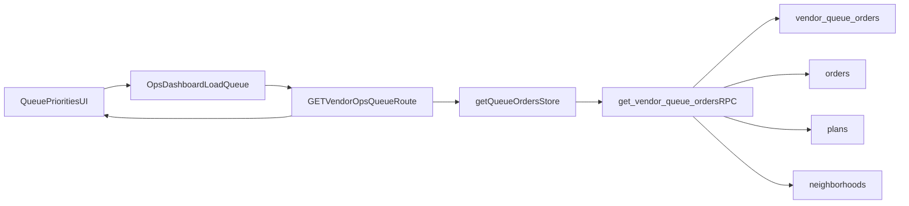

# Show Plan/Neighborhood In Vendor Live Queue

## Approach

Use a vendor-safe database surface (RPC) that returns queue rows plus source metadata (`plan` or `neighborhood`) so the vendor portal can display what each order was placed for without denormalizing queue records.

## Implementation Steps

- Create a Supabase SQL migration that adds a `SECURITY DEFINER` RPC (e.g. `get_vendor_queue_orders(v_vendor_id uuid)`) that:
  - validates vendor membership against the authenticated user (similar to app-level `requireVendorMembership` expectations).
  - selects from `vendor_queue_orders` and left-joins `orders`, `plans`, and `neighborhoods`.
  - returns queue fields plus source metadata fields (e.g. `source_type`, `source_label`, optional `source_slug`).
  - applies stable fallback behavior when names are missing (`plan_id`/`neighborhood_id` fallback).
- Update vendor queue data access in [`/Users/mikaelguillin/projects/neighborhood-tasting-menu-2/apps/vendor-portal/src/lib/vendor-ops-store.ts`](/Users/mikaelguillin/projects/neighborhood-tasting-menu-2/apps/vendor-portal/src/lib/vendor-ops-store.ts) to call the new RPC instead of the raw `vendor_queue_orders` select.
- Extend queue types in [`/Users/mikaelguillin/projects/neighborhood-tasting-menu-2/apps/vendor-portal/src/lib/vendor-ops-types.ts`](/Users/mikaelguillin/projects/neighborhood-tasting-menu-2/apps/vendor-portal/src/lib/vendor-ops-types.ts) with the new source metadata fields.
- Render the new source label in each queue row in [`/Users/mikaelguillin/projects/neighborhood-tasting-menu-2/apps/vendor-portal/src/app/(main)/dashboard/default/_components/queue-priorities.tsx`](</Users/mikaelguillin/projects/neighborhood-tasting-menu-2/apps/vendor-portal/src/app/(main)/dashboard/default/_components/queue-priorities.tsx>) near `orderId`/status so operators can quickly identify context.
- Keep existing queue status mutation path unchanged (`/api/vendor/ops/queue/[id]/status`) since this is read-only metadata enrichment.

## Data Flow

## Validation

- Verify API response at `/api/vendor/ops/queue` includes source metadata for both order shapes:
  - neighborhood-based orders
  - plan-based orders
- Verify queue row UI shows correct label and sensible fallback when metadata is partially missing.
- Verify no regression in queue status update actions from the same list view.

## Files Expected To Change

- New migration under [`/Users/mikaelguillin/projects/neighborhood-tasting-menu-2/supabase/migrations`](/Users/mikaelguillin/projects/neighborhood-tasting-menu-2/supabase/migrations)
- [`/Users/mikaelguillin/projects/neighborhood-tasting-menu-2/apps/vendor-portal/src/lib/vendor-ops-store.ts`](/Users/mikaelguillin/projects/neighborhood-tasting-menu-2/apps/vendor-portal/src/lib/vendor-ops-store.ts)
- [`/Users/mikaelguillin/projects/neighborhood-tasting-menu-2/apps/vendor-portal/src/lib/vendor-ops-types.ts`](/Users/mikaelguillin/projects/neighborhood-tasting-menu-2/apps/vendor-portal/src/lib/vendor-ops-types.ts)
- [`/Users/mikaelguillin/projects/neighborhood-tasting-menu-2/apps/vendor-portal/src/app/(main)/dashboard/default/_components/queue-priorities.tsx`](</Users/mikaelguillin/projects/neighborhood-tasting-menu-2/apps/vendor-portal/src/app/(main)/dashboard/default/_components/queue-priorities.tsx>)
