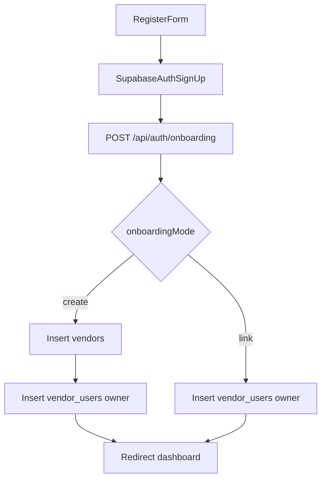

# Functional Vendor Sign-up With Vendor Choice

## Goal

Implement a complete sign-up flow in vendor portal so a new user can:

- create an account,
- choose **Create new vendor** or **Link existing vendor**,
- end with a valid `vendor_users` membership so dashboard/API access works.

## Current Baseline

- Register UI exists but submit is toast-only in [`/Users/mikaelguillin/projects/neighborhood-tasting-menu-2/apps/vendor-portal/src/app/(main)/auth/_components/register-form.tsx`](</Users/mikaelguillin/projects/neighborhood-tasting-menu-2/apps/vendor-portal/src/app/(main)/auth/_components/register-form.tsx>).
- Membership enforcement is already centralized in [`/Users/mikaelguillin/projects/neighborhood-tasting-menu-2/apps/vendor-portal/src/lib/supabase-server.ts`](/Users/mikaelguillin/projects/neighborhood-tasting-menu-2/apps/vendor-portal/src/lib/supabase-server.ts) via `requireVendorMembership()`.
- Vendor schema and linking exist in Supabase (`public.vendors`, `public.vendor_users`).

## Implementation Plan

1. **Add onboarding API endpoint (server-side)**
   - Create `POST` route: [`/Users/mikaelguillin/projects/neighborhood-tasting-menu-2/apps/vendor-portal/src/app/api/auth/onboarding/route.ts`](/Users/mikaelguillin/projects/neighborhood-tasting-menu-2/apps/vendor-portal/src/app/api/auth/onboarding/route.ts).
   - Resolve authenticated user from Supabase session.
   - Accept payload with mode:
     - `create`: `vendorName` (+ optional `description`)
     - `link`: `vendorId` selected from existing vendors
   - Use service-role server client in this endpoint to insert/update safely:
     - `create`: insert `vendors` (slug generated), then insert `vendor_users` as `owner`
     - `link`: insert `vendor_users` as `owner`
   - Add guardrails: reject if user already has membership; handle duplicate slug with retry suffixing; prevent duplicate `(vendor_id, user_id)` inserts.

2. **Expose existing vendors list for sign-up selection**
   - Add read endpoint: [`/Users/mikaelguillin/projects/neighborhood-tasting-menu-2/apps/vendor-portal/src/app/api/auth/vendors/route.ts`](/Users/mikaelguillin/projects/neighborhood-tasting-menu-2/apps/vendor-portal/src/app/api/auth/vendors/route.ts).
   - Return lightweight list (`id`, `name`, `slug`) sorted by name; optionally support search query for future scaling.

3. **Make register form fully functional**
   - Update [`/Users/mikaelguillin/projects/neighborhood-tasting-menu-2/apps/vendor-portal/src/app/(main)/auth/_components/register-form.tsx`](</Users/mikaelguillin/projects/neighborhood-tasting-menu-2/apps/vendor-portal/src/app/(main)/auth/_components/register-form.tsx>):
     - Keep user account fields (email/password/name).
     - Add onboarding selector:
       - `Create new vendor`
       - `Link existing vendor`
     - If `link`, fetch/show existing vendors and allow selection.
     - On submit:
       1. call `supabase.auth.signUp(...)`
       2. if session/user available, call onboarding API
       3. show success/failure toast and redirect to `/dashboard/default` after success.

4. **Tighten auth pages UX**
   - Update [`/Users/mikaelguillin/projects/neighborhood-tasting-menu-2/apps/vendor-portal/src/app/(main)/auth/v1/register/page.tsx`](</Users/mikaelguillin/projects/neighborhood-tasting-menu-2/apps/vendor-portal/src/app/(main)/auth/v1/register/page.tsx>) to redirect already-authenticated users away from sign-up (align behavior with login page).
   - Keep Google button as-is or clearly mark unavailable if still non-functional (no hidden dead path).

5. **Validation and failure behavior**
   - Add clear API error responses for:
     - unauthenticated,
     - vendor not found (link mode),
     - already linked,
     - invalid payload.
   - Surface actionable UI messages in register form.

6. **Verification**
   - Manual checks:
     - Create account + create vendor -> can load dashboard and hit vendor ops APIs.
     - Create account + link existing vendor -> can load dashboard and hit vendor ops APIs.
     - Duplicate link attempt -> blocked gracefully.
   - Run lint/typecheck for `apps/vendor-portal` changed files.

## Flow Diagram

## Files Expected To Change

- [`/Users/mikaelguillin/projects/neighborhood-tasting-menu-2/apps/vendor-portal/src/app/(main)/auth/_components/register-form.tsx`](</Users/mikaelguillin/projects/neighborhood-tasting-menu-2/apps/vendor-portal/src/app/(main)/auth/_components/register-form.tsx>)
- [`/Users/mikaelguillin/projects/neighborhood-tasting-menu-2/apps/vendor-portal/src/app/(main)/auth/v1/register/page.tsx`](</Users/mikaelguillin/projects/neighborhood-tasting-menu-2/apps/vendor-portal/src/app/(main)/auth/v1/register/page.tsx>)
- [`/Users/mikaelguillin/projects/neighborhood-tasting-menu-2/apps/vendor-portal/src/app/api/auth/onboarding/route.ts`](/Users/mikaelguillin/projects/neighborhood-tasting-menu-2/apps/vendor-portal/src/app/api/auth/onboarding/route.ts) (new)
- [`/Users/mikaelguillin/projects/neighborhood-tasting-menu-2/apps/vendor-portal/src/app/api/auth/vendors/route.ts`](/Users/mikaelguillin/projects/neighborhood-tasting-menu-2/apps/vendor-portal/src/app/api/auth/vendors/route.ts) (new)
- (If needed) shared Supabase helper used by new routes under [`/Users/mikaelguillin/projects/neighborhood-tasting-menu-2/apps/vendor-portal/src/lib`](/Users/mikaelguillin/projects/neighborhood-tasting-menu-2/apps/vendor-portal/src/lib)
